# /quantlab bug-fix verification gallery

Playwright captures at 1440×900, Chromium. Each fix is shown in its post-fix state
unless labelled BEFORE. Reduced-motion shots use emulated `prefers-reduced-motion: reduce`.

> This folder is verification evidence for the PR. It can be dropped before merge.

## Bug 1 — MathScroll: one step legible at a time (no ghost stacking)

The exit tween used to leave every prior step at `opacity 0.12`; absolutely-positioned
steps then accumulated as ghost fragments behind the active step. Fixed by exiting to
`autoAlpha 0`. Every prior step is now `opacity 0 / visibility hidden` at each boundary.

BEFORE — step 04 active, ghosts of 01/02/03 bleeding behind:

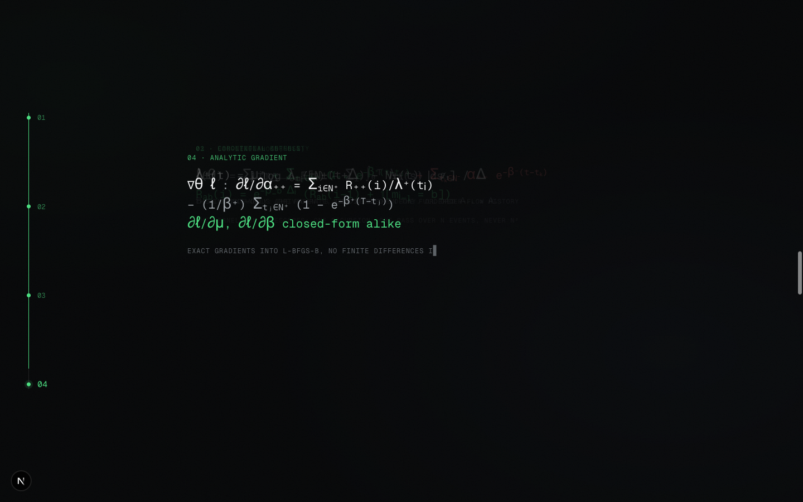

AFTER — step 01 / 02 / 03 / 04, exactly one legible:

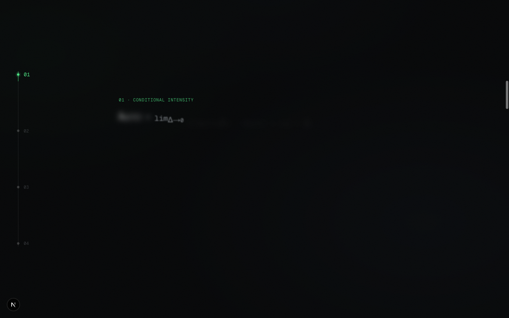
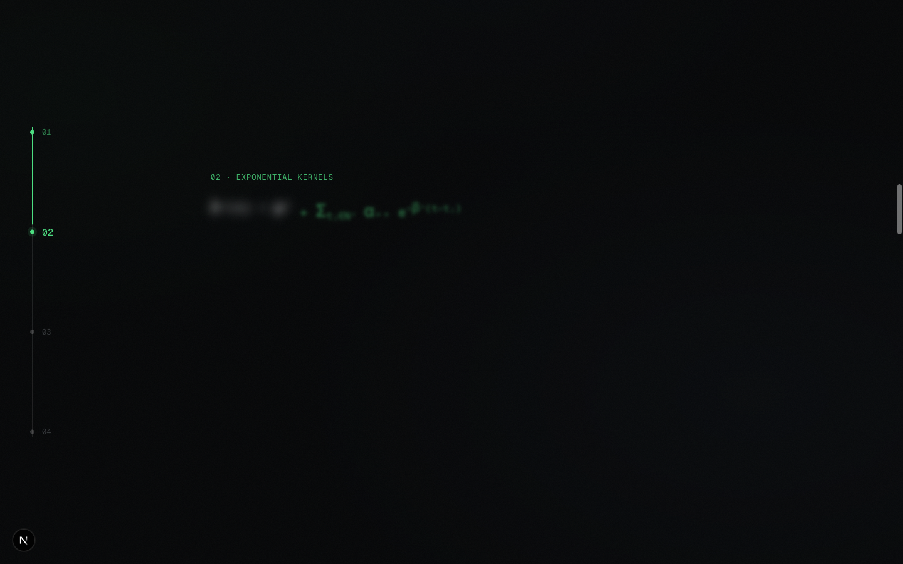
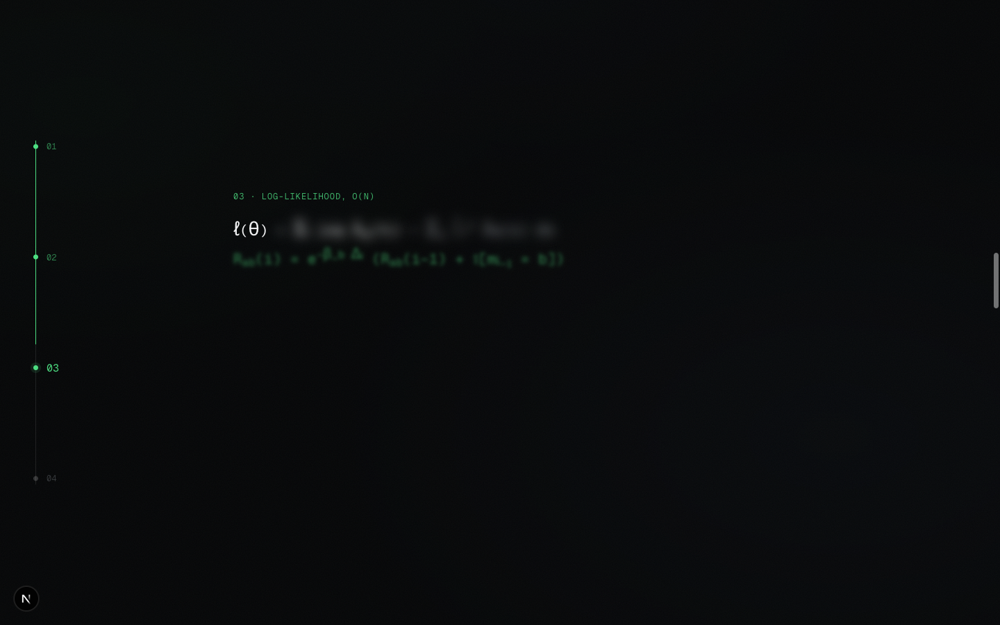
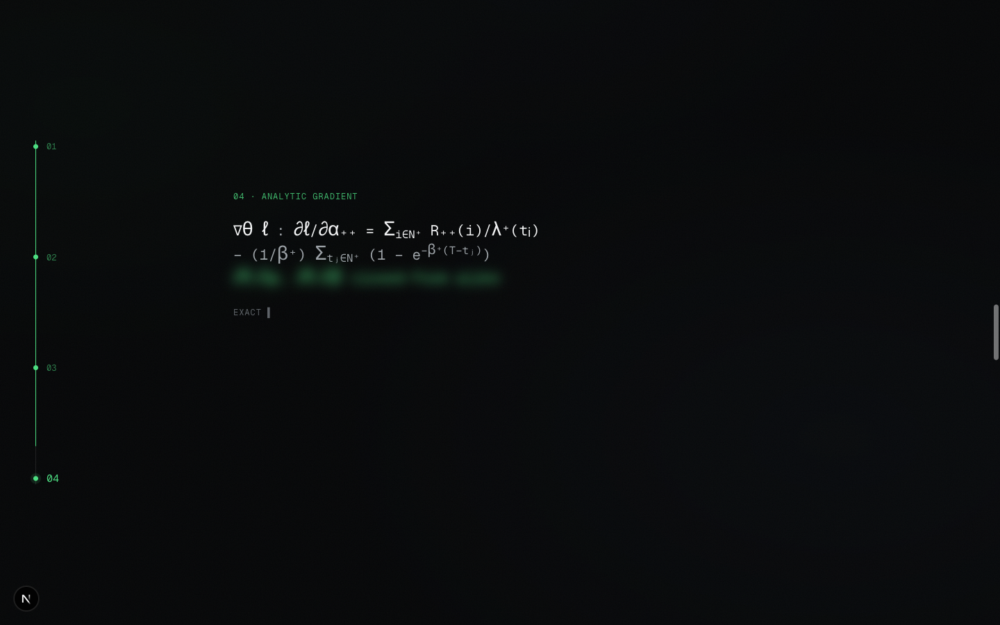

## Bug 2 — SectionHeader: statement + support share the top baseline

`support` was dropping into grid row 2, sized by the (tall, 2-line) h2, so it floated
~150px down with a dead gap. The h2 now spans both rows (`md:[&>h2]:row-span-2`), so the
right column sizes to its own content: index top-right, support tight at 57px, sharing the
statement's top baseline. Visible in the section captures below (0.1, 0.3, 0.4).

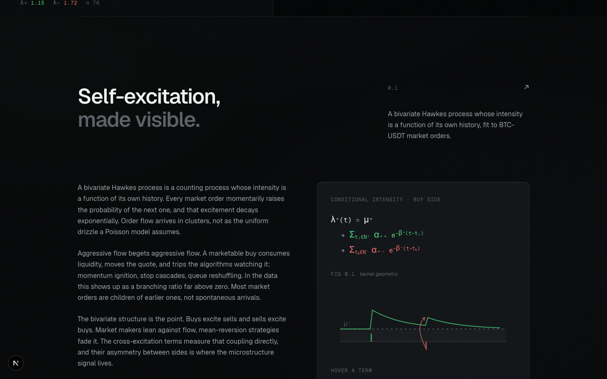

## Bug 5 — every figure draws its strokes

FIG 0.1 (kernel geometry) drew via per-`<path>` `whileInView`; IntersectionObserver on SVG
geometry sub-elements is unreliable outside Chromium, so it could stay undrawn. Now driven
by a single container-level `useInView` on the `<svg>` root. FIG 0.31–0.34 already used a
container observer and keep working. All strokes verified `strokeDashoffset 0`, opacity 1.

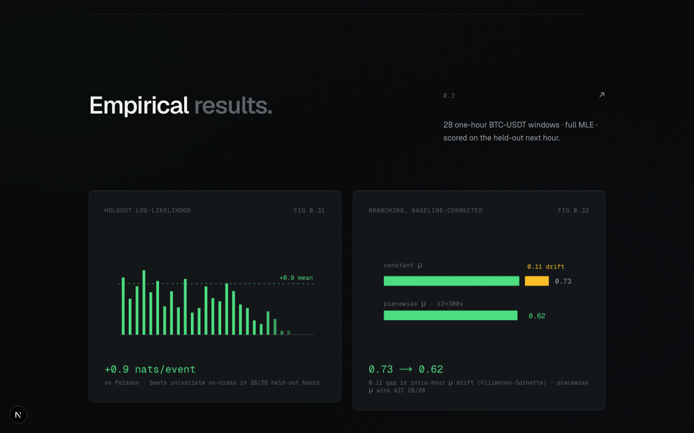
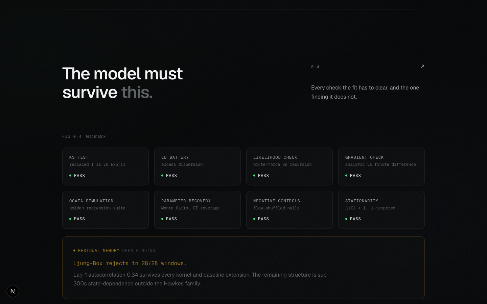

## Bug 3 — roadmap: all phases 00–07 lit

`DONE_THROUGH` is now `phases.length - 1`; all eight nodes render accent, rail lit end to
end, caption updated to "all phases complete".

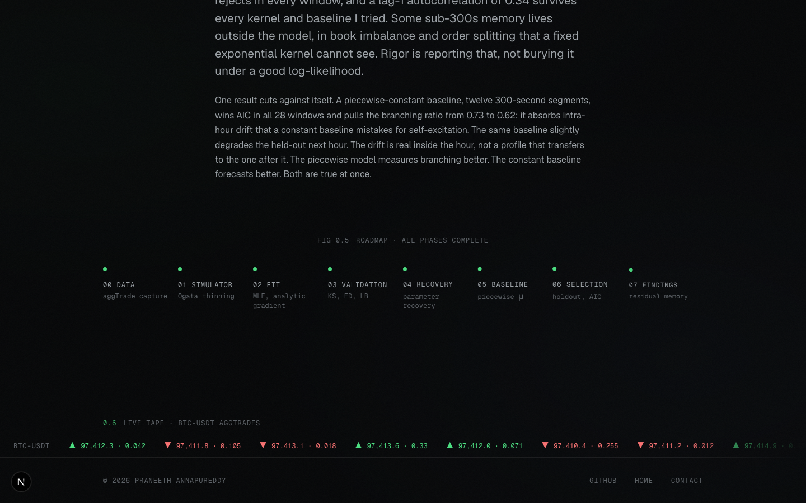

## Bug 4 — footer ticker: direction from price, real quantities

Arrow + colour now come from the sign of the price change vs the previous trade (equal
prints carry the last move), not the aggTrade maker flag. Quantity uses 4 significant
figures so sub-0.001 live sizes no longer collapse to `0.000`.

Live tape (current data all ascending → all ▲; live sizes like `0.00009`, `0.00027`):

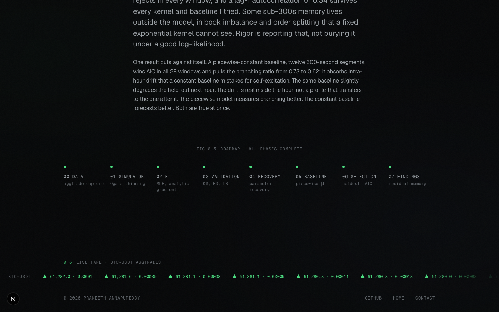

Reduced-motion fallback (mixed prices → 6×▲ / 6×▼, every arrow matches its tick):

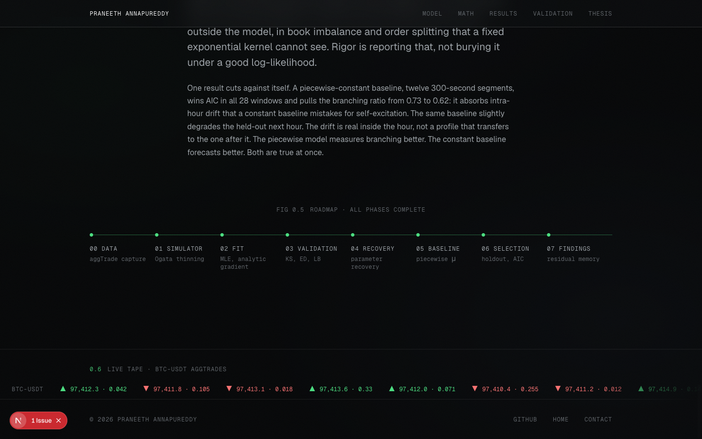

## Reduced-motion audit

Static stacked math (no pin), figures drawn instantly, roadmap lit, ticker arrows correct.

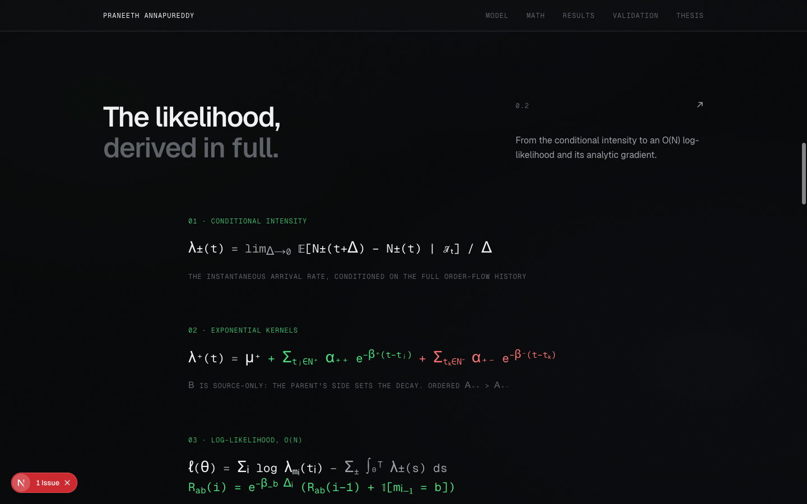
